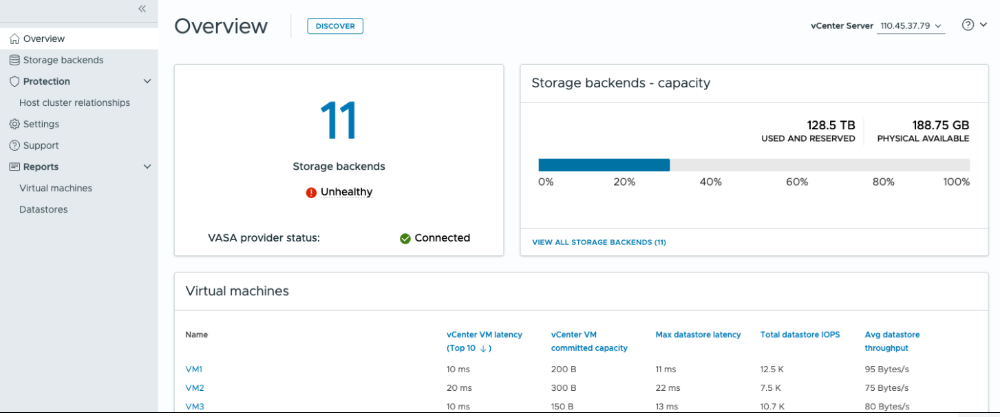

= Visão geral das ferramentas do ONTAP para o painel do VMware vSphere
:allow-uri-read: 
:icons: font
:imagesdir: ../media/

[role="lead"]
Selecionar o ícone do plug-in ONTAP tools for VMware vSphere na seção de atalhos no cliente vCenter abre a página de visão geral.  Este painel fornece um resumo das ONTAP tools for VMware vSphere .

No Modo Vinculado Aprimorado (ELM), o menu suspenso do vCenter Server é exibido.  Escolha um vCenter Server para visualizar seus dados.  O menu suspenso está disponível em todas as visualizações de listagem do plug-in. Ao selecionar um vCenter Server em uma página, ele permanece o mesmo ao alternar entre as guias do plug-in.

Na página de visão geral, você pode executar a ação *Descoberta*. A ação de descoberta detecta backends de armazenamento, hosts, armazenamentos de dados e status de proteção ou relacionamentos recém-adicionados ou atualizados no nível do vCenter.  Execute a descoberta sob demanda sem esperar pela descoberta agendada.

NOTE: O botão de ação *Descoberta* será habilitado somente se você tiver o privilégio necessário para executar a ação de descoberta.

Após o envio da solicitação de descoberta, você pode acompanhar o andamento da ação no painel de tarefas recentes.

O painel de instrumentos tem vários cartões que mostram diferentes elementos do sistema. A tabela a seguir mostra as diferentes cartas e o que elas representam.

|===

| *Cartão* | *Descrição* 

| Estado | O cartão Status mostra o número de backends de armazenamento e o status geral dos backends de armazenamento e do provedor VASA. O status dos backends de armazenamento mostra *saudável* quando todo o status dos backends de armazenamento é normal e mostra *insalubre* se algum dos backends de armazenamento tiver um problema (status desconhecido/inalcançável/degradado). Selecione a dica da ferramenta para abrir os detalhes de status dos backends de armazenamento. Você pode selecionar qualquer back-end de armazenamento para obter mais detalhes. *O link outros estados do provedor VASA* mostra o estado atual do provedor VASA registrado no vCenter Server. 

| Back-ends de armazenamento - capacidade | Este cartão mostra a capacidade agregada utilizada e disponível de todos os backends de armazenamento para a instância selecionada do vCenter Server. No caso de sistemas de armazenamento ASA r2, os dados de capacidade não são exibidos por se tratar de um sistema desagregado. 

| Máquinas virtuais | Esta placa mostra as 10 principais VMs classificadas por métrica de desempenho. Você pode selecionar o cabeçalho para obter as 10 principais VMs para a métrica selecionada ordenadas por ordem crescente ou decrescente. As alterações de classificação e filtragem feitas no cartão persistem até que você altere ou limpe o cache do navegador. 

| Armazenamentos de dados | Este cartão mostra os 10 principais datastores classificados por uma métrica de desempenho. Você pode selecionar o cabeçalho para obter os 10 principais datastores para a métrica selecionada classificados por ordem ascendente ou descendente. As alterações de classificação e filtragem feitas no cartão persistem até que você altere ou limpe o cache do navegador. Há uma lista suspensa tipo de datastore para selecionar o tipo de datastores - NFS, VMFS ou vVols. 

| Placa de conformidade do host ESXi | Este cartão mostra se todos os hosts ESXi (para o vCenter selecionado) seguem as configurações de host NetApp recomendadas por grupo ou categoria. Você pode selecionar o link *Aplicar configurações recomendadas* para aplicar as configurações recomendadas. Você pode selecionar o status de conformidade dos hosts para ver a lista de hosts. 
|===