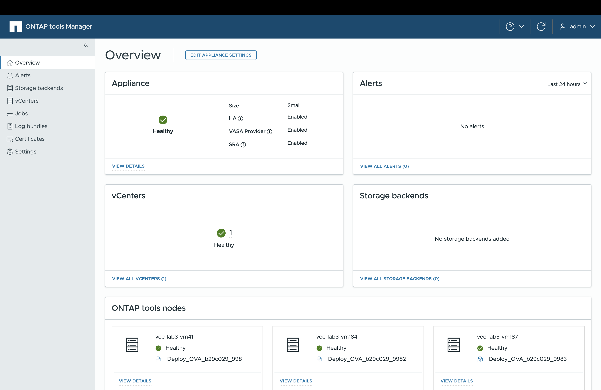

= Interface de usuário do Gerenciador de ferramentas do ONTAP
:allow-uri-read: 
:icons: font
:imagesdir: ../media/

[role="lead"]
As ONTAP tools for VMware vSphere oferecem suporte a multilocação, permitindo o gerenciamento de várias instâncias do vCenter Server.

O ONTAP Tools Manager é um console baseado na web para gerenciar ONTAP tools for VMware vSphere, instâncias do vCenter Server, backends de armazenamento e configuração de dispositivos, como alta disponibilidade (HA) e dimensionamento de nós.

O Gerenciador de ferramentas ONTAP fornece os seguintes recursos:

* Gerenciar alertas - Visualize e filtre alertas gerados pelas ONTAP tools for VMware vSphere.
* Gerenciar backends de armazenamento - Adicione e gerencie clusters de armazenamento ONTAP e mapeie-os para instâncias do vCenter Server globalmente.
* Gerenciar instâncias do vCenter Server - Adicione e gerencie instâncias do vCenter Server nas ferramentas ONTAP .
* Monitorar trabalhos - Monitore e depure trabalhos assíncronos iniciados pela interface do plug-in de ferramentas ONTAP e pela interface do gerenciador de ferramentas ONTAP .  Você pode filtrar trabalhos por período de tempo, ajustar o tamanho da página e visualizar detalhes do trabalho, incluindo erros e subtarefas.  Clique em um status de falha para obter detalhes do erro.  Para trabalhos com subtarefas, expanda a linha para visualizar descrições e status.  Para subtarefas, use o detalhamento da tarefa para visualizar os detalhes.
* Baixar pacotes de log - Coletar arquivos de log para solucionar problemas de ONTAP tools for VMware vSphere.
* Gerenciar certificados - Substitua o certificado autoassinado por um certificado de CA personalizado e renove ou atualize certificados para o VASA Provider e ferramentas ONTAP .
* Redefinir senhas - Altere a senha do VASA Provider e do SRA.
* Gerenciar configurações do dispositivo - Configure o dispositivo de ferramentas ONTAP , incluindo a ativação de HA e o aumento do tamanho dos nós.

Para acessar o Gerenciador de ferramentas do ONTAP, inicie a `\https://<ONTAPtoolsIP>:8443/virtualization/ui/` partir do navegador e faça login com as ferramentas do ONTAP para as credenciais de administrador do VMware vSphere fornecidas durante a implantação.

|===
| *Cartão* | *Descrição* 

| Cartão do aparelho | O cartão Appliance mostra o status geral do appliance ONTAP Tools, detalhes de configuração e o status dos serviços habilitados.  Para ver mais informações, selecione o link *Ver detalhes*.  Se você alterar uma configuração do dispositivo, o cartão mostrará o status do trabalho e os detalhes até que a alteração seja concluída. 

| Cartão de alertas | O cartão Alertas mostra alertas de ferramentas ONTAP categorizados por tipo, incluindo alertas em nível de nó HA.  Você pode visualizar alertas detalhados clicando no hiperlink de contagem, que o leva à página de alertas filtrada pelo tipo de alerta selecionado. 

| Cartão vCenters | O cartão vCenters mostra o status de integridade de todas as instâncias do vCenter Server gerenciadas pelas ferramentas ONTAP .  Você pode visualizar detalhes de cada vCenter selecionando o link correspondente, que leva a uma página com mais informações sobre a instância selecionada. 

| Cartão de backends de armazenamento | O cartão Backends de armazenamento mostra o status de integridade e conectividade de todos os clusters de armazenamento ONTAP configurados nas ferramentas ONTAP .  Você pode visualizar detalhes de cada backend de armazenamento selecionando o link correspondente, que leva a uma página com mais informações sobre o cluster selecionado. 

| Placa de nós de ferramentas do ONTAP | O cartão de nós das ferramentas ONTAP mostra todos os nós no dispositivo, incluindo nome do nó, nome da VM, status e informações de rede.  Selecione *Exibir detalhes* para ver mais detalhes de um nó específico.  [NOTA] Em uma configuração não HA, apenas um único nó aparece.  Em uma configuração de HA, três nós são exibidos. 
|===