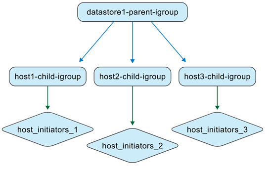

= Como as ONTAP tools gerenciam igroups
:allow-uri-read: 
:icons: font
:imagesdir: ../media/

[role="lead"]
Se você gerencia tanto as VMs do ONTAP tools quanto os sistemas de storage ONTAP, é importante entender como os igroups se comportam, especialmente ao mover datastores de ambientes não gerenciados pelo ONTAP tools para aqueles que são. Esta página explica como o ONTAP tools para VMware vSphere representa e gerencia igroups. Trata-se de informação conceitual para entender as diferenças de comportamento entre versões anteriores e o modelo atual de igroup aninhado.

A partir do ONTAP tools for VMware vSphere 10.4, ONTAP tools cria e mantém automaticamente objetos ONTAP e vCenter, simplificando o gerenciamento de datastores em ambientes de datacenter VMware. A partir do ONTAP tools for VMware vSphere 10.5 P2, os igroups migrados também são excluídos automaticamente quando não estão mais em uso.

[[quick-behavior-summary]]
== Resumo rápido do comportamento

* Os datastores VMFS gerenciados pelas ONTAP tools usam igroups aninhados: um igroup pai por contexto de datastore e igroups filhos por host.
* Os mapeamentos de LUN são aplicados aos igroups filhos.
* Grupos de instâncias (igroups) pais personalizados podem ser reutilizados em diferentes datastores.
* Os igroups migrados das ONTAP tools 9.x não podem ser reutilizados.

[[igroup-contexts]]
== Contextos de igroup

ONTAP tools for VMware vSphere lidam com igroups em dois contextos.

.Ferramentas não ONTAP gerenciam igroups
Como administrador de storage, você pode criar igroups no sistema ONTAP como estruturas planas ou aninhadas. A ilustração a seguir mostra um igroup plano criado diretamente no ONTAP.

image:../media/non-otv-managed.png["Ferramentas não ONTAP gerenciadas igroup"]

.Ferramentas ONTAP gerenciam igroups
Ao criar datastores, ONTAP tools for VMware vSphere cria igroups em uma estrutura aninhada.

Por exemplo, quando o datastore1 é criado e montado nos hosts 1, 2 e 3, e um novo datastore (datastore2) é criado e montado nos hosts 3, 4 e 5, as ferramentas ONTAP reutilizam o igroup de nível de host para gerenciamento eficiente.

image:../media/otv-managed2.png["Ferramentas ONTAP gerenciam igroup com igroup filho reutilizado"]

[[naming-behavior]]
== Comportamento de nomeação

Ao criar um datastore e deixar o campo igroup em branco, ONTAP tools cria uma estrutura de igroup aninhada padrão.

* Padrão de nomenclatura do grupo pai: `otv_<vcguid>_<host_parent_datacenterMoref>_<datastore_name>`
* Padrão de nomenclatura do grupo filho: `otv_<hostMoref>_<vcguid>`

A interface ONTAP mostra a relação entre os igroups pai e filho no campo *Parent Initiator Group*.

[[behavior-by-scenario]]
== Comportamento por cenário

[cols="25,25,25,25"]
|===
| Cenário | Comportamento do igroup parental | Comportamento do igroup filho | Mapeamento e visibilidade de LUN 

| Repositório de dados criado com a configuração padrão do igroup | Um igroup pai padrão gerenciado pelas ONTAP tools é criado. | Grupos de interface (igroups) filhos no nível do host são criados conforme necessário. | Os LUNs são mapeados para igroups filhos. O datastore aparece no inventário do servidor vCenter. 

| Repositório de dados criado com nome de igroup personalizado | Um igroup pai personalizado é criado com o nome especificado. | Os grupos de instâncias (igroups) filhos existentes no nível do host são reutilizados quando os hosts se sobrepõem. | O novo LUN do datastore é mapeado para o igroup filho reutilizado ou recém-criado. O datastore aparece no vCenter Server. 

| Grupo de igroup personalizado existente reutilizado durante a criação do datastore | Um igroup pai personalizado existente é selecionado e reutilizado. | Os grupos filhos são reutilizados ou estendidos com base na associação do host. | O novo LUN do datastore é mapeado através do igroup filho associado. O datastore aparece no vCenter Server. 

| Datastore e igroup criados nativamente no ONTAP e vCenter, depois descobertos pelas ONTAP tools | ONTAP tools cria um igroup pai em seu contexto de gerenciamento e mantém o nome original do igroup. | ONTAP tools renomeia o igroup original com o  `otv_`prefixo e o representa como um igroup filho na hierarquia. | Os mapeamentos de iniciadores permanecem inalterados. Somente os igroups mapeados para datastores são convertidos durante a descoberta. 
|===

[[custom-igroup-reuse-and-api-behavior]]
== Reutilização de igroup personalizado e comportamento da API

Na interface de usuário do ONTAP tools, você pode reutilizar um igroup pai personalizado existente na lista suspensa ao criar um datastore.

O mesmo comportamento é suportado pela API. Para reutilizar um igroup existente durante a criação do datastore, forneça o UUID do igroup na carga da solicitação da API.

NOTE: Somente igroups personalizados podem ser reutilizados. Igroups migrados do ONTAP tools 9.x não podem ser reutilizados e, a partir do ONTAP tools 10.5 P2, são excluídos automaticamente quando não estão mais em uso.

[[native-to-managed-conversion-view]]
== Visão de conversão de nativo para gerenciado

Se você criar o igroup e o datastore diretamente em sistemas ONTAP e ambientes VMware, ONTAP tools não gerencia esses objetos inicialmente. Isso resulta em uma estrutura de igroup plana.

image:../media/vmfsds-native.png["Datastore e igroup criados nativamente"]

Após a descoberta do datastore, ONTAP tools identifica e registra os igroups mapeados para o datastore e, em seguida, os representa em um modelo aninhado. O igroup pai é representado no nível do datastore, o igroup existente é renomeado com o  `otv_` prefixo como um igroup filho, e os mapeamentos de iniciadores permanecem inalterados.

image:../media/otv-ds.png["Datastore e igroup gerenciados por ferramentas ONTAP"]

ONTAP tools for VMware vSphere não detecta nem gerencia igroups que são criados em sistemas ONTAP mas não estão mapeados para um datastore ou vinculados ao ONTAP tools. Durante a descoberta, ONTAP tools converte apenas os igroups que estão mapeados para datastores descobertos; outros igroups permanecem não gerenciados.

[[reuse-of-discovered-native-igroups]]
== Reutilização de igroups nativos descobertos

Após as ferramentas ONTAP gerenciarem um igroup nativo descoberto, esse igroup ficará disponível na lista suspensa de nomes de grupos de iniciadores personalizados para a criação de datastore.

O novo LUN do datastore é mapeado para o igroup filho normalizado, por exemplo,  `otv_NativeIgroup1`.

ONTAP tools for VMware vSphere não detecta nem utiliza igroups criados em sistemas ONTAP que não são gerenciados pelo ONTAP tools ou que não estão vinculados a um datastore.
