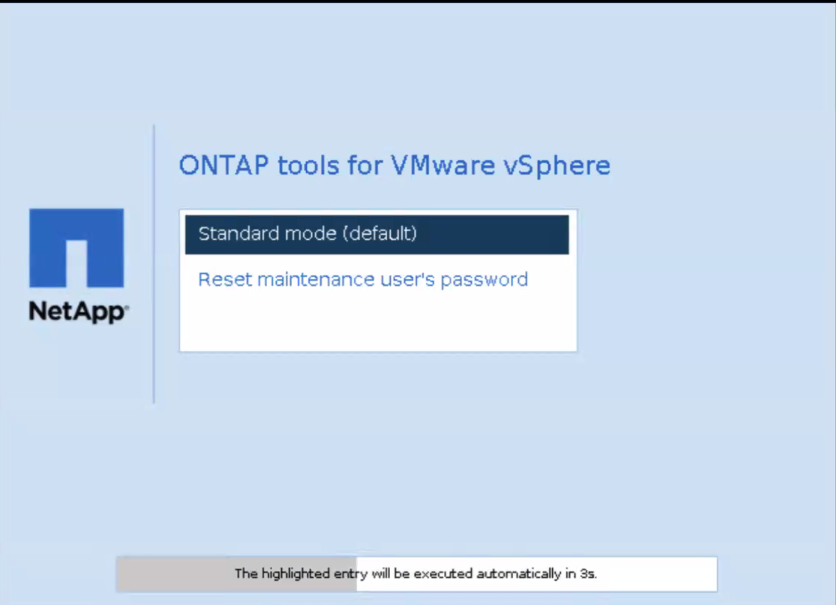

= Redefinir a senha do usuário do console de manutenção
:allow-uri-read: 
:icons: font
:imagesdir: ../media/

[role="lead"]
Durante a reinicialização do sistema operacional convidado, o menu GRUB exibe uma opção para redefinir a senha do usuário do console de manutenção.  Use esta opção para atualizar a senha do usuário do console de manutenção na máquina virtual.  Após redefinir a senha, a máquina virtual será reiniciada para definir a nova senha. No cenário de implantação de alta disponibilidade, após a reinicialização da VM, a senha é atualizada automaticamente nas outras duas VMs.

NOTE: Para ONTAP tools for VMware vSphere HA, você deve alterar a senha do usuário do console de manutenção no nó de gerenciamento de ferramentas ONTAP , que é node1.

.Passos
. Faça login no vCenter Server
. Clique com o botão direito do Mouse na VM e selecione *Power* > *Restart Guest os* durante a reinicialização do sistema, você obtém a seguinte tela: 
+
Você tem 5 segundos para escolher sua opção. Prima qualquer tecla para parar o progresso e congelar o menu GRUB.

. Selecione a opção *Repor a senha do usuário de manutenção*. A consola de manutenção abre-se.
. No console, digite e confirme a nova senha.  Você tem três tentativas.  O sistema reinicia após você inserir a nova senha corretamente.
. Pressione *Enter* para continuar.  O sistema atualiza a senha na máquina virtual.

NOTE: O mesmo menu do GRUB também aparece durante a inicialização da VM. No entanto, você deve usar a opção de redefinição de senha somente com a opção *Reiniciar SO convidado*.
